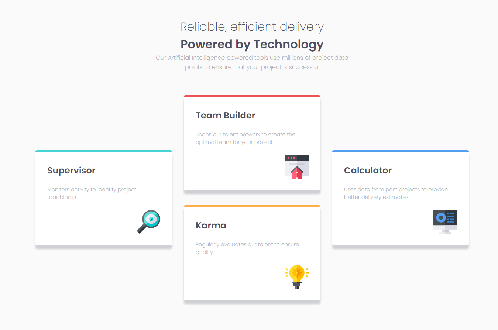
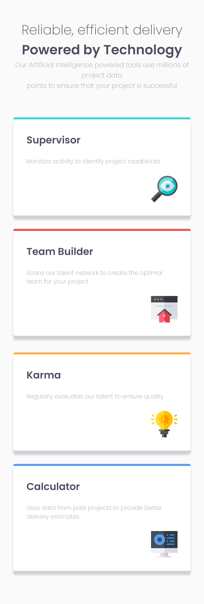

# Frontend Mentor - Four card feature section solution

This is a solution to the [Four card feature section challenge on Frontend Mentor](https://www.frontendmentor.io/challenges/four-card-feature-section-weK1eFYK).

## Table of contents

- [Overview](#overview)
  - [The challenge](#the-challenge)
  - [Screenshot](#screenshot)
  - [Links](#links)
- [My process](#my-process)
  - [Built with](#built-with)
  - [What I learned](#what-i-learned)
  - [Useful resources](#useful-resources)
- [Author](#author)

## Overview

### The challenge

Users should be able to:

- View the optimal layout for the site depending on their device's screen size

### Screenshot

Desktop Screenshot



Mobile Screenshot



### Links

- Solution URL: [Repository](https://github.com/kushagarwal11ag/four-card-feature)
- Live Site URL: [Website](https://kushagarwal11ag.github.io/four-card-feature)

## My process

### Built with

- Semantic HTML5 markup
- CSS custom properties
- Flexbox
- CSS Grid

### What I learned

Applied the design nearly to perfection and made the website as responsive as possible without breaking any feature or losing text.
1. Learned how to specifically add border colors only on a part of element (Here, top of element).
2. Learned how to add box shadows.

```css
.supervisor {
	border-top: 5px solid hsl(180, 62%, 55%);
	box-shadow: 0 10px 5px hsla(229, 6%, 66%, 0.5);
}
```

### Useful resources

- [Box shadows](https://www.w3schools.com/cssref/css3_pr_box-shadow.php - This helped me for XYZ reason. I really liked this pattern and will use it going forward.

## Author

- Frontend Mentor - [@kushagarwal11ag](https://www.frontendmentor.io/profile/kushagarwal11ag)
